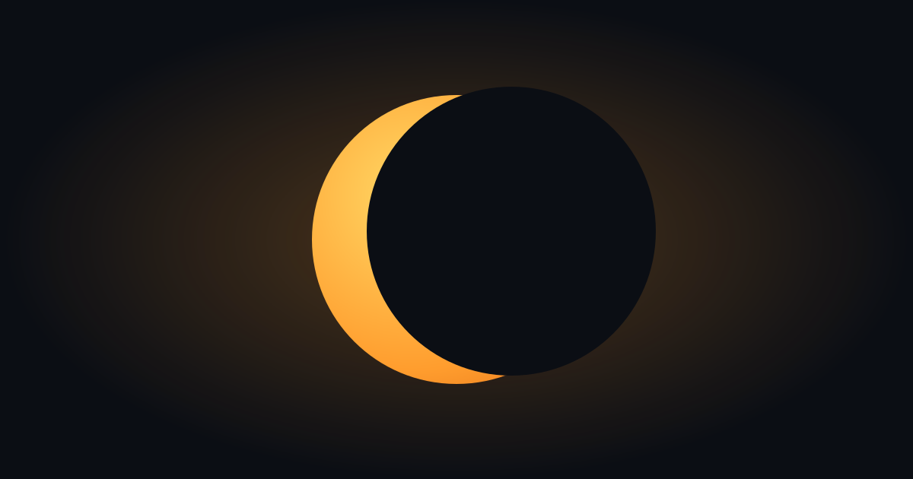

<div align="center">



# Eclipse Checker

**Will you see the next solar eclipse from where you are?**

A free, browser-only web app that tells you exactly when and how much of the next
solar eclipse you'll see from your position — no install, no backend.

</div>

---

## What it does

Point the app at your location (or enter coordinates) and it computes, entirely in
your browser from an ephemeris:

- **When it peaks** — local begin, peak, and end times for the next eclipse.
- **How much of the Sun is obscured** — magnitude and percentage of the solar area.
- **Whether you can actually see it** — the Sun's altitude and azimuth at peak, and a
  plain-English verdict on your view.

Then point your phone at the sky for an **AR overlay** that places the eclipse
against the real sky through your camera — compass-aligned so the crescent sits
exactly where the Moon will darken the Sun.

```
┌─────────────────────────────────────────────┐
│      Sun at peak                             │
│   (●)────────────(●)   altitude 20°  azimuth 265°
│                                            │
│  ✓ Clearly visible darkening of the Sun     │
│    Peak 20:32 local · in 4 days             │
│    Begin 19:36 – End 21:16                  │
│    Obscuration 99.9% of solar area          │
│    [ View in AR ]  [ Share ]                │
└─────────────────────────────────────────────┘
```

## Getting started

```bash
npm install     # deps (Node 22 via .nvmrc)
npm run dev     # Vite dev server
npm run build   # production build to dist/
```

The eclipse is found automatically (searching the ~10-year window) and computed
locally with [`astronomy-engine`](https://github.com/cosinekitty/astronomy) — no
ephemeris API calls at runtime.

## How the math works

The app uses topocentric coordinates for the observer's exact position and
altitude, computes the Sun and Moon's positions on the local sky, and derives:

- eclipse kind and timing (partial / annular / total),
- **magnitude** and **obscuration**,
- the Sun's altitude & azimuth at peak,
- the **position angle** and disc geometry that place the crescent correctly in AR.

All astronomy logic lives in `src/astro/` as a pure, DOM-free module, so it's fully
unit-tested against published NASA / timeanddate values.

## Developer

```
src/
  astro/      Pure astronomy & geometry (no DOM) — tested against NASA values
  sensors/    Browser sensor adapters (geolocation, compass) behind tiny interfaces
  ar/         AR layer — self-hosted 8th Wall engine, scene, controller
  lib/        Pure helpers (share URLs, coordinates, sky-map projection)
  hooks/      React hooks (permission, compass heading)
  ui/         React components
tests/        Vitest specs, including a NASA-reference fixture
```

Useful commands:

```bash
npm test             # Vitest (astronomy verified against NASA/timeanddate values)
npm run typecheck    # tsc --noEmit (strict)
npm run lint         # ESLint flat config
npm run format       # Prettier
npm run generate:qr  # (re)build public/eclipse-checker-qr.svg at build time
```

### Architecture notes

- **AR engine is self-hosted.** The 8th Wall engine ships from `node_modules/` via a
  Vite plugin and is served locally — it's never loaded from a third-party CDN at
  runtime. `xrextras` is MIT.
- **No backend.** Everything — location, ephemeris, eclipse math, the AR scene — runs
  in the browser.
- **Compasless devices** (e.g. desktop) get a QR prompt to open the app on a phone,
  since the AR view and compass-aligned sky map need a magnetometer.
- Share links deep-link straight to the results for a location via `?lat=&lon=…`.

### License & attribution

100% open-source/free. The AR layer runs on the self-hosted **8th Wall engine**
(Niantic Spatial) — free for commercial and noncommercial use under its
[XR Engine License Agreement](https://github.com/8thwall/engine/blob/main/LICENSE),
which requires keeping its attribution notices. `xrextras` is MIT.

---

<div align="center">Built with ❤ — and a lot of orbital mechanics.</div>
